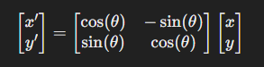

## Explicações Matemáticas

Ao longo do documento serão abordados os temas matemáticos que acabam 
sendo usados, mesmo que de forma não direta, ao implementar o jogo Tétris 
usando PyGame como biblioteca.

### Aplicação de Matriz

No jogo há uma área da tela que visualmente é quadriculada, é nesse local 
onde as peças surgem e o usuário pode movimentá-las para encaixar da 
melhor forma possível. 

No código nós temos uma matriz que é especificada tecnicamente como uma 
lista de listas de números inteiros, essa seria a nossa representação de uma
matriz da matemática, a lista externa representa as linha e a lista interna
representa as colunas.

Cada vez que a peça é movimentada, seja de forma automática (indo para baixo)
ou por ações do usuário (indo para os lados) ocorre a chamada de uma função
que é responsável por obter as posições X e Y de cada bloco que faz parte da
peça e colocar nas respectivas linhas e colunas na matriz do jogo.

Nas configurações padrões do jogo nossa matrix é de ordem 20x10, ou seja,
ela possui 20 linhas e 10 colunas.

### Aplicação de Transformação Linear

Ao realizar a rotação das peças em nosso jogo o que ocorre matematicamente é 
a rotação do vetor bidimensional em um angulo de 90 graus. Isso é feito através
de uma matriz de rotação que pode ser representado da seguinte forma:

Portanto, a rotação de um vetor bidimensional é um exemplo de transformação
linear, onde a matriz de rotação atua sobre o vetor.

